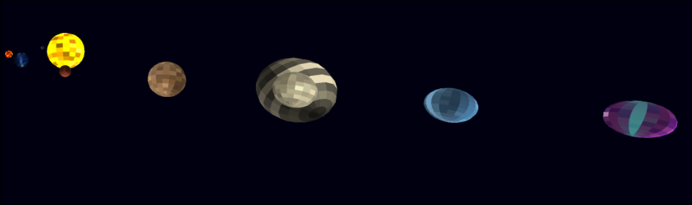
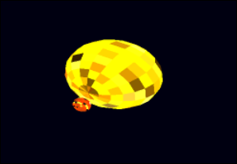
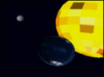
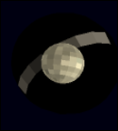
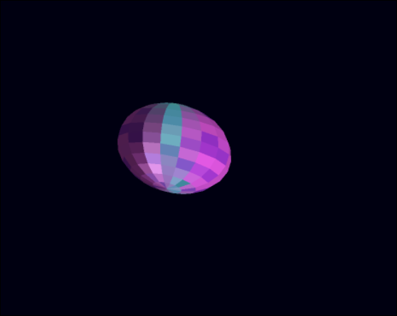

# Sistema Solar - Proyecto Shader-Based 🚀🪐

Sistema solar completo renderizado con **software rasterizer** y **shaders procedurales** (sin texturas).

*Vista general del sistema solar completo*

*Diferentes planetas del sistema con sus características únicas*

---

## � Descripción del Proyecto

Sistema solar interactivo con 8 cuerpos celestes únicos, todos generados mediante **shaders procedurales avanzados** usando técnicas de ruido (FBM, Turbulence, Worley). Implementado en **Rust** con rasterización por software y optimizaciones multi-core.

### 🎮 Controles
- **WASD**: Mover cámara
- **Q/E**: Subir/Bajar
- **Flechas**: Rotar cámara (orbitar)
- **Z/X**: Zoom In/Out
- **ESC**: Salir

---

## 🌟 Cuerpos Celestes Implementados

### ⭐ **Estrella (Requerido)** - 40 puntos

#### **Sol** 
- **Shader de 10+ capas**: Núcleo radiante, corona solar, llamaradas, manchas solares, emisión de luz, gradientes de temperatura
- **Efectos especiales**: Pulsación dinámica, emisión volumétrica, distorsión de calor
- **Ubicación**: Centro del sistema (600, 400, 0)
- **Tamaño**: 80 unidades de radio

---

### 🪨 **Planetas Rocosos (Requerido: 1)** - 40 puntos c/u

#### 1. **Tierra** ⭐ (Planeta Rocoso Principal + Luna)
- **🌙 Luna orbital**: Radio 15 unidades, órbita muy cercana (20 puntos extra)
- **Ubicación**: 250 unidades del Sol
- **Puntos**: **60 puntos** (40 shader + 20 luna)

#### 2. **Marte**
- **Shader de 5 capas**: Superficie oxidada (rojo), dunas, cráteres de impacto, casquetes polares, tormentas de arena
- **Ubicación**: 450 unidades del Sol
- **Puntos**: **40 puntos**

#### 3. **Mercurio/Lava Planet** (Extra)
- **Shader de 6 capas**: Lava fundida, grietas brillantes, superficie negra volcánica, emisión de calor, cenizas, distorsión térmica
- **Ubicación**: 150 unidades del Sol (muy cerca)
- **Puntos**: **10 puntos** (planeta extra)

---

### 🌀 **Gigantes Gaseosos (Requerido: 1)** - 40 puntos c/u

#### 1. **Júpiter** ⭐ (Gigante Gaseoso Principal)
- **Ubicación**: 700 unidades del Sol
- **Tamaño**: 55 unidades (el más grande)
- **Puntos**: **40 puntos**

#### 2. **Saturno** ⭐ (Gigante Gaseoso + Anillos)

- **Shader de 10 capas**: Atmósfera beige/crema, bandas suaves, turbulencias, jet streams, hexágono polar, nubes wispy, scattering
- **🪐 Sistema de Anillos**: 
  - Shader de 4 capas para anillos
  - Bandas principales
  - División de Cassini (gap)
  - Partículas con ruido
  - Translucidez con backlight
  - Radio: 2.5x el planeta
- **Ubicación**: 1000 unidades del Sol
- **Puntos**: **60 puntos** (40 shader + 20 anillos)

---

### 🎨 **Planetas Extra** - 10 puntos c/u

#### 3. **Urano/Ice Planet**
- **Shader de 5 capas**: Hielo azul-turquesa, cristales, grietas congeladas, niebla fría, reflexión especular
- **Ubicación**: 1300 unidades del Sol
- **Puntos**: **10 puntos** (planeta extra)

#### 4. **Neptuno/Alien Planet** ⭐ (Extra con Anillos)

- **Shader de 7 capas**: Superficie alienígena morada/verdosa, bioluminiscencia, patrones orgánicos, tentáculos, atmósfera tóxica, niebla, pulsaciones
- **🪐 Anillos Alienígenas**:
  - Shader de anillos modificado
  - Radio: 4.0x el planeta (ENORMES)
  - Rotación dramática inclinada
  - Bandas de partículas
- **Ubicación**: 1600 unidades del Sol (el más lejano)
- **Puntos**: **30 puntos** (10 planeta extra + 20 anillos)

---

