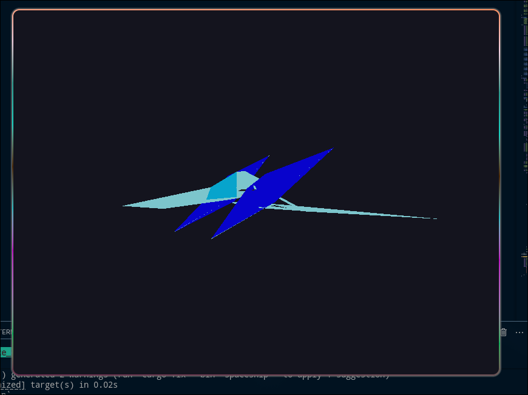

# Sistema Solar - Early Version 🚀

Esta es la versión temprana del proyecto del sistema solar con prueba de nave espacial.

## Descripción

Proyecto en desarrollo que incluye:
- Renderizado de nave espacial
- Prueba de concepto del sistema solar
- Implementado en Rust con Raylib

---
*Work in progress*
