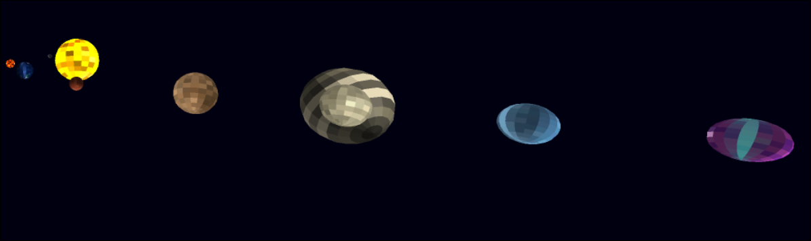
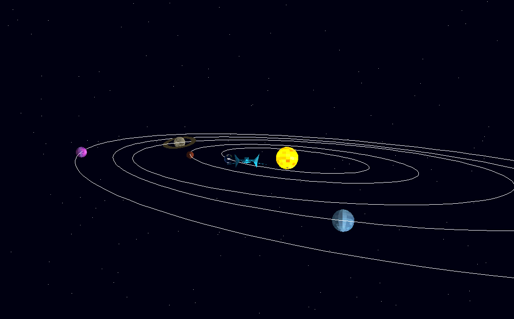
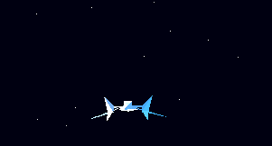
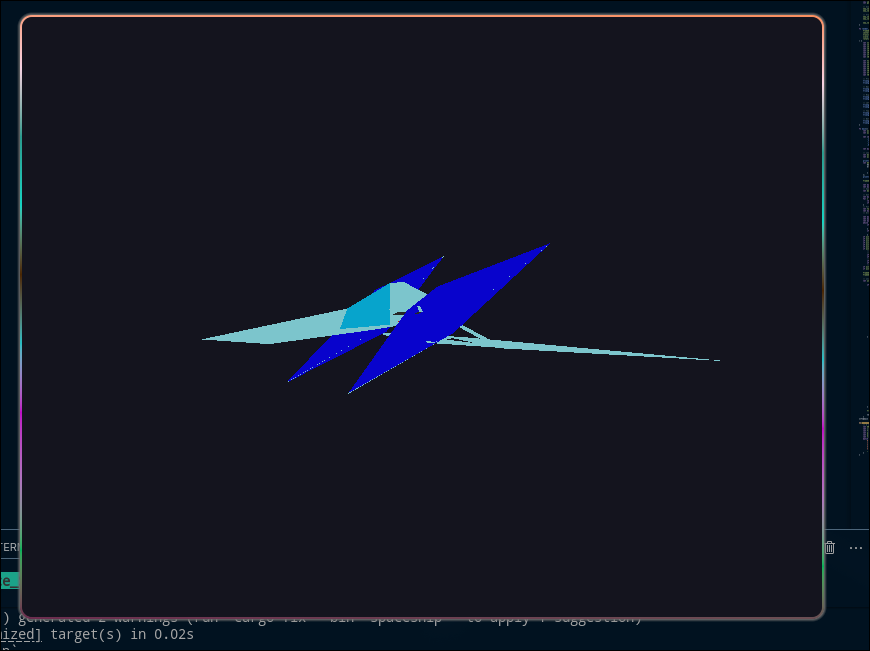
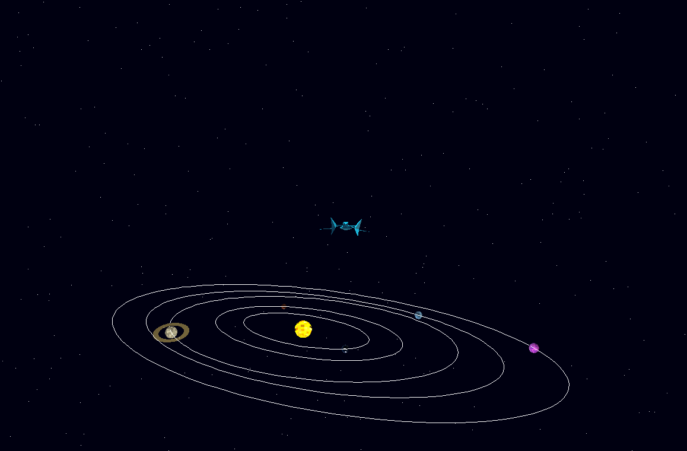
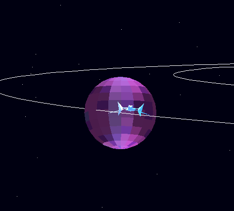

# Sistema Solar - Proyecto Shader-Based 🚀🪐

Sistema solar completo renderizado con **software rasterizer** y **shaders procedurales**

*Vista general del sistema solar completo*

*Diferentes planetas del sistema con sus características únicas*

---

## 📝 Descripción del Proyecto

Sistema solar interactivo con 8 cuerpos celestes únicos, todos generados mediante **shaders procedurales avanzados** usando técnicas de ruido (FBM, Turbulence, Worley). Implementado en **Rust** con rasterización por software y optimizaciones multi-core.

### 🎮 Controles
- **W / S**: Subir o bajar la cámara
- **A / D**: Desplazamiento lateral (strafe)
- **← / →**: Orbitar la cámara alrededor del objetivo
- **↑ / ↓**: Avanzar o retroceder manteniendo la orientación
- **Z / X**: Zoom In/Out sobre el punto de interés
- **O**: Mostrar u ocultar las órbitas
- **ESC**: Salir del programa

---

### Estética General
Inspirada en un sistema solar alienígena: shaders con bioluminiscencia, niebla y bandas cromáticas crean una escena coherente y llamativa.

### Performance de la Escena
El rasterizador por software aprovecha paralelismo con `rayon`; aunque la tasa de cuadros fluctúa, se mantiene utilizable incluso en órbitas densas.

### Planetas, Estrellas y Lunas
Se incluyen Sol, Tierra+Luna, Marte, Saturno con anillos, Ice Planet y Alien Planet; todos con shaders procedurales distintos.

### Nave Personalizada
El Airwing inspirado en StarFox fue modelado en Blender, se renderiza con el mismo rasterizador y mantiene animaciones de alabeo ligadas a la cámara.

### Skybox Estelar
Un campo estelar procedural envuelve la escena para dar profundidad y referencia visual en el horizonte.

### Colisiones Nave/Cámara
El detector de colisiones calcula penetración contra cada cuerpo (excepto el sol) y evita que la nave atraviese planetas o lunas.

### Movimiento 3D de Cámara
La cámara admite traslación 3D, órbitas, zoom relativo y control desacoplado para navegar libremente por el sistema.

### Órbitas Renderizadas
Cada planeta y la Luna muestran su órbita elíptica con segmentación adaptativa, facilitando entender sus trayectorias.

